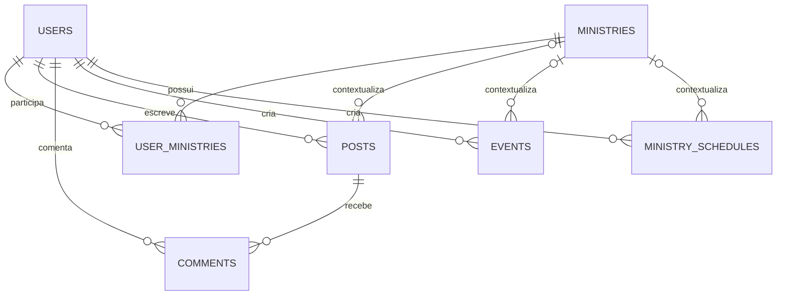
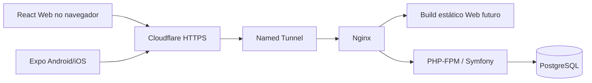

# Arquitetura da aplicação da igreja

A fase 8 implementa publicações de texto e feed, com `PostManagementService`,
`PostDirectory` e `PostController`. Mantém o escopo regular de `ContentReadScope`,
separa gestão de rascunhos/histórico e revalida origem/destino nas escritas.
Contrato em [posts.md](posts.md), sem nova migration.

A fase 7 acrescenta gestão de ministérios, participação e liderança, sem nova
migration. `MinistryManagementService` aplica autorização e auditoria transacionais;
`MinistryDirectory` filtra diretórios no SQL. Contrato em [ministries.md](ministries.md).

Este documento registra as decisões e orienta as próximas fases. A entrega atual inclui infraestrutura Docker, sete entidades do domínio, três entidades de autenticação e `AuditLog`, totalizando onze entidades e três migrations. Autenticação, autorização, cadastro e perfis estão implementados, com administração de cargo/status e senha. Os demais módulos, Web e Mobile continuam nas próximas fases. O README e o registro de validação distinguem comportamento disponível, testes executados e implantação local. O contrato da fase 6 está em [users.md](users.md), sem nova migration.

## 1. Contexto e limites

O repositório inspecionado inicialmente continha somente o arquivo `teste`, sem aplicação, dependências ou infraestrutura de projeto. O arquivo existente deve ser preservado.

O produto atende uma igreja, com API central, aplicação Web administrativa e de membros e aplicativo Android/iOS. Não será introduzido multitenancy neste MVP. A evolução acontecerá por módulos dentro de um monólito Symfony: não há necessidade inicial de microsserviços, filas, Redis ou múltiplos bancos.

Regras de negócio e autorização pertencem ao backend. A interface pode orientar o usuário, mas cada requisição deve ser validada independentemente de botões visíveis e dados enviados pelo cliente.

### Stack e decisões de versão

| Camada | Decisão |
| --- | --- |
| API | PHP, Symfony 7.4 LTS, Doctrine ORM/DBAL, REST e JSON |
| Runtime principal | PHP 8.4 em container Linux; manter inicialmente código compatível com PHP 8.2 para as verificações disponíveis no host |
| Banco | PostgreSQL 17 em volume persistente, com migrations Doctrine |
| Web | React, TypeScript e Vite, implementados na fase 12 |
| Mobile | React Native, Expo, Expo Router e TypeScript, implementados na fase 13 |
| Entrada HTTP | Nginx com PHP-FPM; build estático da Web quando existir |
| Infraestrutura | Docker Compose; Cloudflare Named Tunnel após validação local |

Symfony 7.4 foi escolhido por ser uma versão LTS com requisito mínimo PHP 8.2. O projeto deve fixar dependências em arquivos de lock e receber atualizações deliberadas, sem depender de tags `latest`. [Referência oficial da versão](https://symfony.com/releases/7.4).

O PHP instalado no host é auxiliar: não substitui a validação com a versão e extensões do container. As versões de React, Vite e Expo serão escolhidas por compatibilidade entre si quando essas aplicações forem iniciadas, sem adicionar dependências antecipadamente.

## 2. Organização do repositório

Estrutura alvo; diretórios de funcionalidades futuras só precisam ser criados quando tiverem conteúdo útil:

```text
igreja-app/
├── apps/
│   ├── api/
│   │   ├── config/
│   │   ├── migrations/
│   │   ├── public/
│   │   ├── src/
│   │   │   ├── Controller/
│   │   │   ├── DTO/
│   │   │   ├── Entity/
│   │   │   ├── Enum/
│   │   │   ├── Repository/
│   │   │   ├── Service/
│   │   │   ├── Security/
│   │   │   ├── Validator/
│   │   │   └── Exception/
│   │   └── tests/
│   ├── web/                 # fase 12
│   └── mobile/              # fase 13
├── packages/
│   ├── api-client/          # compartilhamento quando houver consumidores
│   ├── types/
│   ├── validation/
│   └── shared/
├── docker/
│   ├── nginx/
│   └── php/
├── docs/
├── docker-compose.yml
├── .env.example
└── README.md
```

Controllers recebem a requisição, validam DTOs, acionam serviços e retornam a representação de saída. Serviços executam casos de uso e demarcam transações. Repositórios concentram consultas e filtros de acesso; Voters decidem permissões sobre objetos e operações. Entities e enums protegem invariantes do domínio. Evitar criar uma interface por classe ou um framework interno de autorização.

O Web e o Mobile compartilham contratos TypeScript, cliente HTTP, schemas de entrada e utilitários quando houver necessidade real. A API continua validando tudo. Componentes visuais, navegação e armazenamento de credenciais são específicos de cada plataforma. Um contrato OpenAPI versionado na implementação da API permitirá verificar os consumidores sem duplicar regras do backend.

## 3. Modelo inicial do banco

### Convenções

- Chaves primárias numéricas geradas pelo banco; IDs são identificadores, nunca prova de autorização. Manter valores dentro da faixa segura do JavaScript ou definir representação textual no contrato antes de alterá-los para `bigint`.
- Nomes de tabelas em `snake_case`. Usar `users`, evitando o identificador SQL `user`.
- Instantes em `timestamptz`, tratados em UTC pela API e serializados em ISO 8601 com offset. `birth_date` é `date`, sem conversão de fuso.
- `created_at` e `updated_at` em entidades mutáveis; atualizar explicitamente no backend. Campos obrigatórios têm `NOT NULL`.
- Enums PHP backed por strings e valores restritos também no banco por `CHECK`. Sem strings de status improvisadas nos controllers.
- FKs reais, constraints e migrations revisadas. A validação Symfony produz mensagens úteis; constraints preservam a integridade sob concorrência.
- Imagens e arquivos são objetos de armazenamento, não blobs no PostgreSQL. A referência inicial será uma chave/ID de arquivo; a URL autorizada é produzida na camada de saída.

### Entidades principais

| Entidade | Campos iniciais e observações |
| --- | --- |
| `User` / `users` | `id`, `name`, `email`, `email_normalized`, `password_hash`, `phone?`, `birth_date?`, `avatar_asset_id?`, `role`, `status`, `created_at`, `updated_at`. Email normalizado único; senha jamais retornada pela API. |
| `Ministry` / `ministries` | `id`, `name`, `slug`, `description?`, `image_asset_id?`, `cover_asset_id?`, `status`, `created_at`, `updated_at`. Slug único; nomes não são identificadores. |
| `UserMinistry` / `user_ministries` | `id`, `user_id`, `ministry_id`, `is_leader`, `status`, `joined_at`, `left_at?`, `created_at`, `updated_at`. Entidade associativa explícita; um registro por par usuário/ministério. |
| `Post` / `posts` | `id`, `author_id`, `ministry_id?`, `title`, `content`, `image_asset_id?`, `visibility`, `comments_enabled`, `status`, `published_at?`, `created_at`, `updated_at`. Ministério ausente representa publicação geral da igreja. |
| `Comment` / `comments` | `id`, `post_id`, `user_id`, `content`, `status`, `created_at`, `updated_at`. Autorização de leitura sempre depende da publicação. |
| `Event` / `events` | `id`, `ministry_id?`, `created_by`, `title`, `description?`, `image_asset_id?`, `visibility`, `location?`, `address?`, `starts_at`, `ends_at?`, `status`, `created_at`, `updated_at`. |
| `MinistrySchedule` / `ministry_schedules` | `id`, `ministry_id?`, `created_by`, `title`, `description?`, `starts_at`, `ends_at?`, `visibility`, `status`, `created_at`, `updated_at`. Ministério opcional permite agenda geral, exigida na fase 11. |

O nome `MinistrySchedule` segue a especificação; `ministry_id` é opcional para acomodar a agenda geral sem criar outra entidade idêntica. Eventos têm divulgação, localização e detalhes próprios; itens de agenda representam atividades de organização. A visão de agenda pode combinar ambos sem copiar eventos para a tabela de atividades.

Na fase 3, os campos de imagens `*_asset_id` foram adiados até a implementação de `Asset`, na fase de uploads. As demais colunas principais estão mapeadas. Isso evita referências sem FK ou URLs privadas publicadas prematuramente. Os métodos de entidades preservam invariantes locais. As fases 4 e 5 implementaram autenticação, autorização do ator, proteção do último ADMIN e revogação de liderança ao reduzir cargo ou inativar/bloquear a conta. Operações administrativas de participação e atribuição de liderança estão implementadas na fase 7.

### Cardinalidades



Usuários e ministérios têm uma relação N:N por `UserMinistry`. Um usuário pode participar de zero ou vários ministérios, liderar um subconjunto deles, e um ministério pode ter vários líderes. Cada post tem exatamente um autor e zero ou um ministério; cada comentário tem exatamente um post e um autor. Eventos e atividades têm um criador e zero ou um ministério.

### Estados, constraints e índices

| Área | Invariantes e índices iniciais |
| --- | --- |
| Usuários | `role IN (ADMIN, PASTOR, LEADER, MEMBER)`; `status IN (ACTIVE, INACTIVE, BLOCKED)`; `UNIQUE(email_normalized)`; índice `(status, created_at, id)` para gestão. A normalização de email é definida uma vez no serviço e usada no login e cadastro. |
| Ministérios | `status IN (ACTIVE, INACTIVE)`; `UNIQUE(slug)`; validação de formato e tamanho do slug. |
| Participações | `UNIQUE(user_id, ministry_id)`; `status IN (ACTIVE, INACTIVE)`; `is_leader = true` exige `status = ACTIVE`; `left_at >= joined_at` quando preenchido. Índices `(user_id, status, ministry_id)` para autorização e `(ministry_id, status, is_leader, user_id)` para gestão. |
| Conteúdo | `visibility IN (PUBLIC, MINISTRY_MEMBERS)`; `visibility = MINISTRY_MEMBERS` exige `ministry_id IS NOT NULL` em posts, eventos e agenda. Conteúdo geral privado não tem significado definido no MVP e é rejeitado. |
| Posts | `status IN (DRAFT, PUBLISHED, ARCHIVED)`; `PUBLISHED` exige `published_at`; índices `(status, published_at, id)` e `(ministry_id, status, published_at, id)` para feed; FK `author_id` indexada. |
| Comentários | `status IN (VISIBLE, HIDDEN, DELETED)`; índices `(post_id, status, created_at, id)` e `user_id`. Texto obrigatório e limitado. |
| Eventos e agenda | `status IN (DRAFT, PUBLISHED, CANCELLED, ARCHIVED)`; `ends_at >= starts_at` quando preenchido; índices `(status, starts_at, id)` e `(ministry_id, status, starts_at, id)`; FK do criador indexada. |

Esses são índices candidatos diretamente associados às consultas previstas; rever SQL e planos de execução ao implementar cada módulo. Não criar índices isolados de baixa seletividade em todos os enums. O índice único de participação já atende buscas pelo par. Busca textual avançada pode adotar índice específico posteriormente, conforme volume real.

Regras entre tabelas, como cargo do participante e proteção do último administrador, não cabem em um `CHECK` simples. Devem ser aplicadas em serviços transacionais com bloqueio adequado e testes de concorrência; todas as entradas administrativas, inclusive comandos de manutenção, devem usar esses serviços.

### Tabelas auxiliares

`AuthSession`, `RefreshToken` e o controle de limites `AuthLoginLimit` foram implementados
na fase 4. `AuditLog` foi implementado na fase 5 pela migration `Version20260911050000`.
Configurações, arquivos e notificações abaixo permanecem planejados.

| Entidade | Finalidade e campos mínimos |
| --- | --- |
| `AuthSession` | `id` aleatório, `user_id`, `client_type`, `created_at`, `last_used_at`, `expires_at`, `revoked_at?`; representa a família de refresh de um dispositivo/sessão. |
| `RefreshToken` | `id`, `session_id`, `token_hash`, `created_at`, `expires_at`, `consumed_at?`, `revoked_at?`, `replaced_by_id?`; hash único, índices de sessão e expiração. Não armazenar token bruto. |
| `AuditLog` | `id`, `actor_id?`, `action`, `entity_type`, `entity_id`, `metadata` JSON limitado, `request_id`, `created_at`; índices por entidade/data e ator/data. Registro de append, sem segredos e sem cópias desnecessárias de dados pessoais. |
| `ChurchSettings` | Registro único tipado para `name`, `timezone` e configurações gerais; alteração técnica/crítica exclusiva de ADMIN. Segredos de infraestrutura continuam fora do banco de configurações. |
| `Asset` | Na fase de uploads: `id`, `storage_key`, `mime_type`, `size`, `original_name`, `uploaded_by`, `created_at`. Permissão deriva do recurso que usa o arquivo; arquivo órfão fica restrito ao fluxo de upload. |
| Notificações | Na fase 14: registros de destinatário/leitura, dispositivos push por usuário e sessão, preferências e tentativas de entrega. Não criar schema especulativo nem enviar notificações neste primeiro marco. |

## 4. Autenticação

A fase 4 implementa as decisões abaixo. O contrato executável, os valores adotados,
a exceção explícita de HTTP no loopback, o bootstrap de ADMIN e os limites estão em
[authentication.md](authentication.md). JWT usa firebase/php-jwt com RS256; sessões,
refresh e limites persistem no PostgreSQL. Um trigger revoga sessões na mudança de
senha ou inativação/bloqueio. Os resultados executados ficam em [validation.md](validation.md).

### Decisão para Web e Mobile

O access token será um JWT assinado por biblioteca madura do ecossistema Symfony, com duração inicial proposta de 10 minutos. Claims mínimos: `sub`, `sid`, `iat`, `exp`, `iss`, `aud` e identificador do token quando necessário. Validar algoritmo permitido, assinatura, emissor, audiência e expiração. Chaves privadas e segredos não entram no Git ou em imagens Docker.

O refresh token será opaco, aleatório e de alta entropia, com expiração absoluta inicial proposta de 30 dias por sessão. Apenas seu hash será persistido; hash criptográfico de token aleatório não substitui o password hasher para senhas. O mecanismo de hashing de senha será `auto` do Symfony, com rehash quando recomendado pela configuração do framework.

| Plataforma | Access token | Refresh token |
| --- | --- | --- |
| Web | Somente em memória; cabeçalho `Authorization: Bearer` | Cookie HttpOnly e Secure, host-only no domínio da API, sem `Domain`, `SameSite=Lax`; evitar `localStorage`/`sessionStorage` |
| Mobile | Memória, recuperado por refresh ao reiniciar | Expo SecureStore; enviado apenas ao endpoint de renovação via HTTPS |

Em produção, o cookie poderá usar nome `__Host-refresh`, exigindo `Secure`, ausência de `Domain` e `Path=/`. A API enviará `Cache-Control: no-store` nas respostas de autenticação. O endpoint Web nunca retornará o refresh token no JSON. Para o Mobile, o fluxo explicitamente próprio retorna o token para armazenamento seguro. Definir contratos separados para os dois transportes na fase 4, sem aceitar silenciosamente cookie e token de corpo simultâneos.

`app.dominio.com.br` e `api.dominio.com.br` são origens diferentes. O cliente Web precisa de `credentials: include` nas chamadas que usam cookie, e o backend precisa permitir apenas a origem exata configurada, com credenciais. Não usar `Access-Control-Allow-Origin: *` com credenciais. O cookie host-only reduz o compartilhamento de credencial entre subdomínios.

`SameSite` não dispensa proteção CSRF: login, refresh e logout do fluxo Web validam `Origin` por allowlist, exigem JSON/cabeçalhos apropriados e aplicam estratégia de token CSRF conforme o contrato escolhido. Requisições do fluxo Web com origem inesperada ou ausente devem ser recusadas segundo política explícita. O Mobile usa transporte sem cookie e não deve ser uma exceção genérica que libere operações com cookie para clientes sem `Origin`. O desenvolvimento HTTP em loopback terá configuração específica, sem reutilizar cookies ou segredos de produção.

### Rotação e revogação

1. Login verifica credenciais, status ativo e limites de tentativas, cria uma sessão/família e o primeiro refresh token, e emite o JWT.
2. Refresh calcula o hash, bloqueia o registro/sessão em uma transação e valida usuário ativo, sessão não revogada, validade absoluta e token não consumido.
3. Na mesma transação, marca o token antigo como consumido e cria o sucessor. Só retorna o novo par depois do commit.
4. Reutilização de token já consumido revoga a família inteira de forma transacional. Tokens consumidos devem ser retidos até expirar a janela da família para detectar replay.
5. Logout revoga a sessão no servidor e limpa o cookie/armazenamento. Troca de senha, bloqueio e ações de segurança revogam as sessões aplicáveis.

O cliente serializa renovações em andamento; no Web, coordenar abas quando necessário. Uma requisição de refresh repetida após perda de rede não pode criar duas cadeias válidas. Na política inicial de detecção estrita, uma repetição pode exigir novo login; isso deve ser tratado claramente na interface e testado.

A API consulta o usuário e a sessão atuais em cada requisição autenticada. Um JWT válido não autoriza um usuário inativo, uma sessão revogada ou um cargo antigo. As decisões de permissão usam estado atual do banco; cache futuro terá invalidação explícita. Isso torna logout, bloqueio, perda de cargo e remoção de participação efetivos sem aguardar a expiração do JWT.

Endpoints previstos: `POST /api/auth/login`, `POST /api/auth/refresh`, `POST /api/auth/logout`, `GET /api/auth/me`. Login terá resposta genérica para credenciais inválidas, limite por conta e origem e sem registrar credenciais. O primeiro ADMIN deverá ser criado por comando de console controlado, com entrada segura de senha, sem cadastro administrativo público ou senha padrão versionada.

## 5. Autorização e privacidade

A fase 5 implementa `AccessPolicy`, o predicado SQL compartilhado `ContentReadScope`
e Voters para usuários, ministérios, posts, eventos, agenda e comentários. As decisões
usam estado atual do PostgreSQL, sem conceder poder por campos do token ou entidades
obsoletas. O [contrato de autorização](authorization.md) registra as primeiras rotas:
consulta de permissões, listagem/detalhe administrativo de usuários, alteração
transacional de cargo/status e leituras protegidas de conteúdo. A suíte completa
passou com 299 testes e 2.027 verificações em PostgreSQL isolado; a implantação local
é registrada separadamente em [validation.md](validation.md).

### Quatro conceitos independentes

1. Cargo global: ADMIN, PASTOR, LEADER ou MEMBER.
2. Participação: vínculo ativo em `UserMinistry` com ministério ativo.
3. Liderança: vínculo ativo com `is_leader = true` no ministério específico, combinado com cargo que permita administrar.
4. Visibilidade e estado do conteúdo: determinam quem pode ler e em que momento.

Para LEADER, o cargo global é necessário e insuficiente: só administra quando lidera o ministério alvo. MEMBER não ganha administração por um `is_leader` isolado. ADMIN e PASTOR possuem autorização operacional global, mas podem também participar e liderar ministérios como dados de organização.

| Operação | ADMIN | PASTOR | LEADER | MEMBER |
| --- | --- | --- | --- | --- |
| Ler conteúdo PUBLIC publicado | Sim | Sim | Sim, de todos os ministérios | Sim, de todos os ministérios |
| Ler conteúdo privado publicado | Todos | Todos | Somente ministérios com vínculo ativo | Somente ministérios com vínculo ativo |
| Criar/editar conteúdo geral | Sim | Sim | Não | Não |
| Criar/editar conteúdo de ministério | Todos | Todos | Somente onde possui liderança ativa | Não |
| Gestão global de usuários/ministérios/líderes | Sim | Sim, sem administrar ADMIN | Não | Não |
| Configurações críticas e cargos ADMIN | Sim, com salvaguardas | Não | Não | Não |
| Moderar comentários | Sim | Sim | Não no MVP | Não |

PUBLIC significa acessível aos membros autenticados, não publicação anônima na Internet. ADMIN e PASTOR também precisam estar ativos e autenticados.

### Invariantes administrativas

As regras de alteração de cargo/status, proteção do último ADMIN e auditoria já
estão aplicadas em `UserAccessService`. A lista também orienta os endpoints de
participação/liderança e escrita de conteúdo que serão adicionados nas próximas fases.

- Atribuir liderança exige uma operação autorizada de ADMIN/PASTOR. A mesma transação cria/reativa a participação e marca a liderança. Se o alvo é MEMBER, a operação precisa declarar explicitamente a promoção para LEADER e validar autorização para essa mudança; não aceitar promoção oculta em um DTO genérico. ADMIN/PASTOR que lideram permanecem com seus cargos.
- Reduzir o cargo para MEMBER remove as marcações de liderança na mesma transação. Remover ou inativar participação remove liderança e acesso privado imediatamente. A reativação de participação não restaura liderança automaticamente.
- Ser LEADER sem qualquer liderança ativa é permitido; não concede administração. Remover a última liderança não precisa alterar automaticamente o cargo global.
- ADMIN é o único que pode criar/promover/rebaixar/desativar administradores. PASTOR não altera conta, senha, status, papel ou autoridade de ADMIN, inclusive por endpoints indiretos.
- Deve permanecer pelo menos um ADMIN ativo. Alterações concorrentes de status/cargo/exclusão de administradores usam bloqueio serializado consistente e teste de concorrência. A proteção vale inclusive para autodesativação.
- A especificação menciona um ADMIN principal. Até existir uma regra explícita de titularidade, a salvaguarda é proteger todos os administradores de alterações feitas por PASTOR e preservar um ADMIN ativo. Se houver um proprietário imutável, modelar a transferência e recuperação antes de implementá-lo.
- Mover publicação, evento ou atividade entre ministérios exige autorização sobre origem e destino; LEADER não pode transformar conteúdo em conteúdo geral ou atribuí-lo a outro ministério por mass assignment.

### Implementação no Symfony

O firewall aplica autenticação a `/api`, exceto login, refresh e health segundo configuração explícita. Voters como `MinistryVoter`, `PostVoter`, `EventVoter`, `ScheduleVoter`, `CommentVoter` e `UserVoter` verificam ações específicas. Serviços de políticas compartilhados podem fornecer os predicados usados pelos Voters, sem tratar hierarquia de roles como prova de liderança.

Na implementação atual, `AuthorizedContentReader` e as políticas de detalhe usam
`ContentReadScope` para preservar o mesmo escopo. `AdminUserReader` exclui contas ADMIN
de listas, contagens e detalhes acessíveis a PASTOR. `UserAccessService` adquire o
bloqueio administrativo compartilhado com o bootstrap, bloqueia usuários em ordem
de ID e revalida a sessão e a autorização antes da alteração. A mudança e `AuditLog`
são confirmados na mesma transação; uma falha na auditoria desfaz a alteração.

Para listar dados, repositórios aplicam a permissão **antes** de paginação, ordenação, contagem e agregações. Não buscar registros privados para depois escondê-los em PHP ou JavaScript. O feed regular equivale conceitualmente a:

```text
usuário ativo e sessão válida
E post.status = PUBLISHED
E post.published_at <= agora
E (post é geral OU ministério está ativo)
E (
    usuário é ADMIN ou PASTOR
    OU post.visibility = PUBLIC
    OU (post.visibility = MINISTRY_MEMBERS
        E existe UserMinistry ativo entre o usuário e o ministério do post)
)
```

Usar `EXISTS` ou joins adequados para evitar duplicatas e N+1; paginar com ordenação determinística, por exemplo `published_at DESC, id DESC`. Começar com `page` e `limit`, teto de 100 e padrão 20; cursor pode ser adotado se o volume justificar. Contadores, filtros, busca, exportação e dashboard precisam obedecer ao mesmo escopo.

Visibilidade não elimina a regra de estado: um rascunho PUBLIC não aparece para todos. Rascunhos e conteúdo arquivado só são consultados por quem pode administrar aquele conteúdo, em endpoints/consultas administrativos. Usuário que perdeu liderança não preserva acesso administrativo só por ser autor. Conteúdo de ministério inativo fica fora da leitura regular e disponível à gestão global para manutenção/histórico. Eventos cancelados podem continuar visíveis aos destinatários autorizados para informar o cancelamento; isso não deve expor rascunhos ou arquivos.

Consultas por ID usam o mesmo escopo ou Voter sobre o recurso carregado. Para recursos privados fora do escopo, responder 404 de forma consistente, evitando confirmar existência. Para operação proibida sobre recurso que o usuário já pode ver, responder 403.

Em `/api/ministries/10/events/25`, validar autenticação, permissão da operação e que `event.ministry_id === 10`; liderança do ministério 10 não autoriza o evento 25 de outro ministério. Aplicar o mesmo controle a comentários de posts, membros de ministérios e arquivos vinculados. IDs do corpo não podem substituir contexto autorizado da rota.

Comentários herdam a leitura do post. Criar comentário exige post legível, publicado e comentários habilitados. Listar, consultar, editar e remover um comentário também exige acesso atual ao post. No MVP, o autor pode editar/remover o próprio comentário sob política explícita de estado; ADMIN/PASTOR moderam. Moderação por líderes fica para evolução posterior.

Na fase 9, edição/remoção pelo autor exige VISIBLE. Fechar novos comentários não
impede corrigir os existentes. As rotas administrativas de ADMIN/PASTOR consultam
VISIBLE/HIDDEN e permitem manutenção também em posts em rascunho, arquivados ou
de ministério inativo, conforme a política global existente; as rotas regulares
continuam exigindo leitura atual do post. DELETED é terminal e não é serializado.
Contrato, paginação e auditoria em [comments.md](comments.md).

A fase 10 adiciona gestão e listagem de eventos com filtros por período. Horários
exigem segundos e fuso explícito, são normalizados para UTC e validados após a
combinação de PATCH com o estado persistido. O filtro de período inclui eventos
em andamento. Cancelar rascunho/arquivado é recusado para impedir exposição indireta;
cancelados publicados mantêm a audiência. Contrato em [events.md](events.md).

A fase 11 implementa atividades em `ministry_schedules` e a agenda combinada em
`GET /api/calendar`. As duas fontes aplicam seus escopos antes de UNION ALL,
contagem e paginação global; a identidade pública é `kind + id`. A leitura não
persiste cópias de eventos. Sem `from`, a agenda usa o instante atual do banco
para trazer próximos compromissos e atividades em andamento. Contrato em [agenda.md](agenda.md).

## 6. API e validação

DTOs aceitam apenas campos permitidos em cada caso de uso. Nunca desserializar um corpo arbitrário diretamente para uma Entity com setters de cargo, autoria ou liderança. Usar Symfony Validator para tipos, comprimentos, datas, emails, enumerações e relacionamentos; o serviço valida as invariantes e a autorização.

As rotas REST propostas na especificação serão mantidas quando implementadas. Alterações de participação e liderança terão endpoints explícitos. `DELETE` administrativo pode representar desativação/arquivamento conforme o recurso; documentar essa semântica no contrato.

Formato de erro previsto:

```json
{
  "error": {
    "code": "VALIDATION_ERROR",
    "message": "Verifique os campos informados.",
    "details": [{ "field": "email", "message": "Informe um e-mail válido." }],
    "request_id": "identificador-da-requisicao"
  }
}
```

Usar 400 para JSON/requisição malformada, 401 para autenticação ausente/inválida, 403 para ação proibida, 404 para recurso ausente ou ocultado pelo escopo, 409 para conflito de estado/unicidade, 422 para validação de campos e 500 para falha inesperada. Nunca retornar stack traces em produção. Respostas de entidades usam DTOs/serialização explícita para não incluir hashes, sessões ou dados pessoais de participantes indevidamente.

## 7. Arquivos, auditoria e retenção

Uploads entram por endpoint autenticado, com autorização do destino, limites de tamanho, verificação de MIME real, extensões permitidas e nomes gerados pelo servidor. Não permitir execução de arquivos e evitar SVG/HTML ativo sem tratamento específico. Conteúdo textual começa como texto seguro; se houver rich text, definir sanitização no backend e renderização segura no cliente.

Arquivos privados ficam fora da raiz pública do Nginx. O download verifica a permissão atual no recurso proprietário e pode usar encaminhamento interno autorizado. Em S3, usar objetos privados e URLs assinadas curtas emitidas após autorização. URL obscura e cache público não são mecanismos de privacidade. Uma URL assinada permanece válida até expirar; se revogação imediata for requisito, manter download por API/proxy autorizado. CDN, logs, miniaturas e notificações não podem vazar conteúdo privado.

Usuários e ministérios são desativados; posts são arquivados; eventos são cancelados/arquivados. Evitar soft delete duplicado sem significado: usar status como mecanismo inicial. FKs de autoria e histórico usam restrição a exclusão física, sem `ON DELETE CASCADE` para apagar histórico de ministério ou usuário. Exclusão física e anonimização serão operações controladas com política de retenção e impacto documentados.

`UserMinistry` preserva o registro ao encerrar a participação (`INACTIVE`, `left_at`, `is_leader=false`). Na reativação, o mesmo par é reutilizado; auditoria registra transições. Um histórico completo de múltiplos intervalos pode ser acrescentado posteriormente, sem fingir que uma linha contém todos os períodos.

Auditar mudanças de cargo/status, participação/liderança, exclusão/arquivamento e configurações na mesma transação da mudança. Diferenciar auditoria de logs técnicos. Logs usam identificador de requisição e não armazenam senha, tokens, cookies, chaves, headers de autorização ou conteúdo pessoal sem necessidade. Definir retenção, acesso restrito e rotação antes de receber usuários reais.

## 8. Docker, rede e execução



Serviços iniciais: `nginx`, `php` e `postgres`. PostgreSQL participa de rede interna e não publica porta no host. Nginx é a entrada HTTP local; preferir bind em loopback para desenvolvimento. PHP comunica com PostgreSQL pela rede Docker e não tem porta FPM publicada no host. O código é montado no desenvolvimento ou incorporado à imagem de execução; volumes persistem o banco e, quando necessário, arquivos.

PostgreSQL tem health check de prontidão; PHP possui ping FastCGI e Nginx verifica a API. `GET /api/health` é uma rota pública mínima, sem consultar o banco. `GET /api/ready` executa `SELECT 1` via Doctrine e retorna 503 genérico quando a conexão falha. Ambos omitem versões, credenciais e stack traces. Os testes usam outro PostgreSQL em tmpfs e uma rede exclusiva, sem conexão ao banco da aplicação.

O primeiro marco é `docker compose up` com PostgreSQL, PHP-FPM e Nginx operacionais e `GET /api/health` retornando `{"status":"ok"}`. Comandos e resultado das verificações realizadas ficam no README/relato da etapa. A existência dos arquivos Compose não comprova execução dos containers.

`cloudflared` será habilitado depois da validação local, preferencialmente como serviço/perfil separado. Named Tunnel terá rotas para os hosts `app` e `api` apontando ao Nginx com `server_name` correspondente e regra final que rejeite hosts desconhecidos. Não usar Quick Tunnel como ambiente dos primeiros membros.

Definir trusted proxies/hosts de forma restrita na integração do túnel, considerando o caminho real até o PHP. Não confiar em qualquer `X-Forwarded-For` ou `X-Forwarded-Proto` recebido da Internet. Configurar a origem externa HTTPS corretamente para cookies, URLs, rate limiting e logs. Não armazenar cache de API autenticada/privada na Cloudflare.

Variáveis previstas: `APP_ENV`, `APP_DEBUG`, `APP_SECRET`, `DATABASE_URL`, credenciais locais do PostgreSQL, caminho/material de chaves JWT, origens CORS permitidas, timezone e `CLOUDFLARE_TUNNEL_TOKEN` quando habilitado. Versionar somente exemplos; `.env` real, chaves, volumes, `vendor`, `node_modules`, logs e builds não entram no Git. Chaves e tokens devem ser provisionados em runtime com permissões restritas.

O caminho para VPS preserva imagens, Compose e configuração por ambiente. Não fixar caminhos Windows no código da aplicação. No Windows, usar Docker Desktop com containers Linux e WSL2; no VPS, executar o mesmo conjunto em Linux, ajustar DNS/tunnel e restaurar dados. A execução e segurança do VPS precisam ser validadas separadamente.

## 9. Operação e recuperação

Hospedagem no computador pessoal depende de energia, conexão, disponibilidade da máquina e saúde do disco. Suspensão, reinícios, atualização do sistema ou Docker parado interrompem o serviço. Cloudflare Tunnel fornece caminho de acesso, sem substituir hospedagem, backup ou monitoramento.

Antes de uso real, definir responsável operacional, janelas de manutenção, espaço em disco, alertas de saúde, limites de recursos, rotação de logs e atualização de imagens/dependências. Migrações devem ser executadas explicitamente em implantação; não aplicar alterações destrutivas automaticamente a cada reinício.

Plano mínimo de dados:

1. Gerar backup consistente com `pg_dump` em formato custom, além dos arquivos armazenados e configurações necessárias para reconstrução.
2. Copiar backup criptografado para outro dispositivo/serviço, com credenciais separadas e retenção definida. Volume Docker no mesmo disco não é backup externo.
3. Registrar versão do PostgreSQL, data, resultado, checksum e procedimento de restauração. Proteger dump como dado sensível.
4. Restaurar periodicamente em banco isolado com `pg_restore`, aplicar/verificar migrations e conferir login, vínculos e visibilidade com contas de teste.
5. Fazer backup antes de migrações relevantes; rollback de aplicação não desfaz automaticamente alteração de schema/dados. Preferir mudanças compatíveis e planejar recuperação.

Frequência, retenção, perda tolerável de dados (RPO) e tempo tolerável de recuperação (RTO) devem ser acordados antes do lançamento. O marco de infraestrutura documenta essa necessidade; não afirma que backup automático ou restauração testada já existem.

## 10. Riscos e decisões a confirmar nas fases apropriadas

| Ponto | Direção inicial e momento de decisão |
| --- | --- |
| ADMIN principal | Proteger todos os ADMIN de PASTOR e impedir ausência de ADMIN ativo; definir eventual proprietário e recuperação antes da gestão de usuários. |
| Cadastro e acesso inicial | Cadastro por ADMIN/PASTOR; primeiro ADMIN por console. Definir convite, troca obrigatória de senha e recuperação de conta na fase de autenticação/usuários. |
| Dados pessoais | Restringir campos e listas por necessidade; definir consentimento, retenção e tratamento de menores antes de coletar dados reais. Não ampliar perfil por conveniência. |
| Fuso da igreja | UTC persistido; timezone IANA configurável na igreja. Confirmar localidade antes de cadastrar agenda real. |
| Recorrência | MVP com ocorrências explícitas; recorrência, exceções e escalas posteriores. |
| Visibilidade de diretório | Membro vê seus vínculos; acesso a dados de outros participantes é restrito à gestão global e líderes autorizados, com campos mínimos. |
| Conteúdo em ministério inativo | Ocultar do feed regular; manter manutenção/histórico para ADMIN/PASTOR. |
| Upload e tamanho | Definir formatos, quota, limite e retenção antes de ativar upload; iniciar com imagens permitidas e armazenamento local encapsulado. |
| Sessões e cookies | Durações propostas precisam de validação de uso; fluxo Web/Mobile e testes de CSRF devem estar fechados antes de liberar autenticação. |
| Domínio e disponibilidade | Domínio, configuração Cloudflare e responsabilidade de operação serão definidos na fase 15; não bloqueiam o bootstrap local. |
| Push | Implementar após estabilidade; destinatários e dados devem respeitar acesso atual. Evitar texto privado em notificações de tela bloqueada. |

O roteiro e critérios verificáveis de cada fase estão em [implementation-plan.md](implementation-plan.md). Nenhuma pendência de produto acima exige antecipar telas ou recursos além do primeiro marco.
